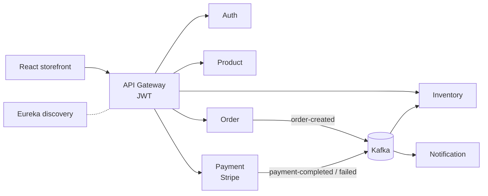

<h1 align="center">Hi, I'm Anjan Rimal 👋</h1>
<h3 align="center">Software Engineer building reliable backends, clean frontends, and the cloud infrastructure that runs them</h3>

  
  
  

  

---

### 🧑‍💻 About me

- 🎓 Studied at **Webster University**
- ☕ Backend focus: **Java & Spring Boot** REST APIs secured with **Spring Security & JWT**
- ⚛️ Frontend: **React** (Vite), responsive, production-deployed UIs
- 🤖 AI engineering: **LLM apps** with RAG, tool calling, structured outputs and evals
- 🧩 Distributed systems: **microservices**, **Kafka** event-driven design, service discovery
- ☁️ Cloud & DevOps: **AWS (EKS, RDS, MSK)**, **Terraform**, **Kubernetes & Helm**, **Ansible**, CI/CD with GitHub Actions
- 🧠 Sharpening problem-solving on [LeetCode](https://leetcode.com/u/Anjanrimal/)
- 📫 Best way to reach me: [LinkedIn](https://www.linkedin.com/in/anjanrimal)

---

### 🛠️ Tech stack

**Languages**

  
  
  
  

**Backend**

  
  
  
  
  
  
  
  
  
  
  

**Frontend**

  
  
  
  
  

**AI / LLM**

  
  
  
  

**Cloud & DevOps**

  
  
  
  
  
  
  
  
  
  

---

### 🚀 Featured projects

### 🛒 [ShopSphere](https://github.com/shopsphere-platform): cloud-native e-commerce platform

An event-driven microservices platform: 7 Spring Boot services behind an API gateway, communicating over **Kafka**, with a React storefront, provisioned on **AWS with Terraform** and deployed to **EKS with Helm** through GitHub Actions.

| Layer | What I built |
|---|---|
| **Services** | [Auth](https://github.com/shopsphere-platform/shopsphere-auth-service) (JWT), [Product](https://github.com/shopsphere-platform/shopsphere-product-service) (search, featured), [Order](https://github.com/shopsphere-platform/shopsphere-order-service), [Payment](https://github.com/shopsphere-platform/shopsphere-payment-service) (Stripe intents + webhooks), [Inventory](https://github.com/shopsphere-platform/shopsphere-inventory-service) (Redis, low-stock alerts), [Notification](https://github.com/shopsphere-platform/shopsphere-notification-service); Spring Boot, PostgreSQL per service |
| **Platform** | [API Gateway](https://github.com/shopsphere-platform/shopsphere-api-gateway) (Spring Cloud Gateway, JWT validation), [Eureka discovery server](https://github.com/shopsphere-platform/shopsphere-discovery-server) |
| **Events** | Kafka topics `order-created`, `payment-completed` and `payment-failed` decouple ordering, payment, inventory and notifications |
| **Frontend** | [Storefront](https://github.com/shopsphere-platform/shopsphere-storefront): React, Vite, Tailwind, React Router |
| **Infrastructure** | [Terraform](https://github.com/shopsphere-platform/shopsphere-infrastructure) modules for VPC, EKS, 6× RDS Postgres, MSK (Kafka) and ElastiCache (37 AWS resources); Ansible turns Terraform outputs into Kubernetes Secrets; one reusable Helm chart deploys all 9 components |
| **CI/CD** | GitHub Actions per service: test → build → Docker image to GHCR → `helm upgrade` on EKS |

### More projects

**🤖 AI engineering**

| Project | What it is | Stack |
|---|---|---|
| [**Library AI Assistant**](https://github.com/AnjanRimal/library-ai-assistant) | Claude-powered assistant with RAG, tool calling, validated structured outputs, guardrails, cost and latency tracking, and an eval suite that gates CI. Can use my Spring Boot library-api as its catalog. | Python, Claude API, FastAPI |

**🔐 Secure backend APIs**

| Project | What it is | Stack |
|---|---|---|
| [**Mini Twitter**](https://github.com/AnjanRimal/mini-twitter) | Social API with JWT auth, tweets, likes, follow/unfollow and a personalized timeline | Spring Boot, Spring Security, JWT, MySQL |
| [**Blog API**](https://github.com/AnjanRimal/blog-api) | Blogging API with role-based access (user/admin), author-only edits and public reads | Spring Boot, Spring Security, JWT, MySQL |
| [**Library API**](https://github.com/AnjanRimal/library-api) | Library system with a many-to-many author/book model, DTOs and a borrow/return workflow | Spring Boot, JPA, MySQL |
| [**Employee API**](https://github.com/AnjanRimal/employee-api) | Employee and department management with validation and custom exception handling | Spring Boot, JPA, MySQL |
| [**Student CRUD API**](https://github.com/AnjanRimal/student-crud-api) | Clean CRUD API that runs with zero setup on an in-memory database | Spring Boot, JPA, H2 |

**🌐 Web**

| Project | What it is | Stack |
|---|---|---|
| [**Ventrora**](https://github.com/AnjanRimal/ventrora) · [live ↗](https://ventrora.vercel.app) | Full e-commerce storefront for a luxury fragrance brand: collections, product pages, cart drawer, 3-step checkout, wishlist, accounts and a scent-finder quiz | React 18, Vite, Vercel |
| [**anjanrimal.com**](https://github.com/AnjanRimal/Anjanrimal.com) · [live ↗](https://anjanrimal.com/) | My portfolio site | HTML, CSS, JavaScript |
| [**Django Contact Form**](https://github.com/AnjanRimal/Django-Contact-Form) | Contact form that emails submissions over SMTP | Python, Django |

Where I started: [hello-world-api](https://github.com/AnjanRimal/hello-world-api), my first Spring Boot API.

---

### 📊 GitHub stats

  
  

  

  

---

<i>Open to Software Engineering roles — feel free to connect!</i>

